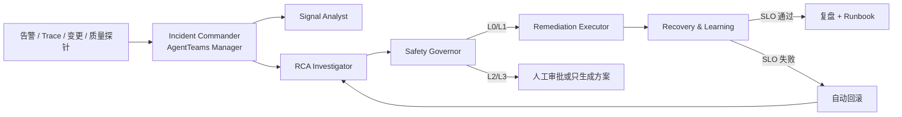

# InferGuard 技术方案

## 设计目标

InferGuard 面向运行 vLLM、SGLang 或同类推理引擎的平台工程团队。它处理的不只是“Pod 是否存活”，而是推理服务的三维恢复：可用性、性能和回答质量。

## AgentTeams 设计基点

- 角色编排：Incident Commander 对应 Manager，五个职能角色对应专用 Workers。
- 任务拆解：Manager 按 `detected -> investigating -> planned -> authorized -> remediating -> verifying` 状态机派发任务。
- 上下文传递：`Incident` 是唯一共享状态，携带 Alert、Evidence、Hypothesis、ActionPlan、Verification 和 Trace 索引。
- 协同执行：Worker 只调用身份允许的 Skills；执行 Agent 无权签发自己的执行许可或验证自己的结果。
- 状态追踪：每次状态变化与 Skill/工具结果写入 `TraceEvent`，后续映射到 Matrix 事件和 AgentLoop/OpenTelemetry Span。
- 人机协同：L2 动作在 Matrix 房间请求批准；L3 动作永不执行。

## 分层

1. AgentTeams 编排层：Manager/Workers、Matrix 协作、任务状态。
2. Skill 能力层：告警归并、证据采集、RCA、治理、执行、验证和复盘。
3. MCP/Adapter 层：Higress、vLLM、Prometheus、Kubernetes、模型注册中心与质量评测。
4. 状态与知识层：Incident State、历史事故、Runbook RAG、审计证据。
5. 可观测层：Agent/Skill/Tool/LLM Trace，决策日志和质量、时延、成功率指标。

## 当前实现与迁移

当前 `SimulatedOperationsBackend` 是等价工具契约：以结构化参数调用、返回结构化结果，并实现白名单、幂等、参数检查、审计结果和回滚。迁移 MCP 时仅把这些方法替换为 MCP Client，Agent 与 Skill 的输入输出无需重构。

第二阶段接入优先级：

1. AgentTeams Manager/Workers 与共享事故文件。
2. Prometheus、vLLM 和 Higress 只读 MCP 工具。
3. Kubernetes/Higress 灰度流量执行工具。
4. AgentLoop 或 OpenTelemetry Trace。
5. Runbook RAG 与事故记忆。

## 评测

| 指标 | 定义 | 初赛证据 |
|---|---|---|
| 告警压缩率 | 原始告警数 / 唯一事故信号数 | Demo 为 7/5 = 1.4x |
| RCA Top-1 | 首位根因是否命中标注 | 当前案例命中，置信度 0.89 |
| 安全拦截率 | L3/非白名单动作被拒绝比例 | 自动测试覆盖 |
| 恢复判定 | 可用性、性能、质量 SLO 是否同时通过 | 三项均写入 incident.json |
| 可审计性 | 关键阶段是否存在结构化 Trace | 当前闭环 9 个事件 |

