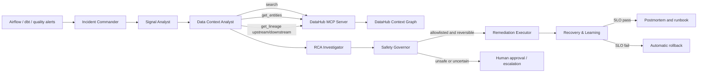

# DataHub Integration

## Purpose

InferGuard DataOps uses DataHub as the trusted context layer for incident response. Operational alerts show that something failed; DataHub explains what the affected asset is, who owns it, what changed upstream, and which systems are exposed downstream.

## Architecture



## Required DataHub capabilities

The live adapter uses the official open-source DataHub MCP Server and these read-only tools:

- `search` resolves the operational service name to catalog assets.
- `get_entities` retrieves schema, ownership, domain, documentation, and health context.
- `get_lineage` traces upstream causes and downstream impact across multiple hops.

The adapter queries the tool schemas exposed by the connected MCP server and sends only supported arguments. Mutation tools are deliberately disabled in this version; DataHub context informs decisions but cannot authorize or execute a production change.

## Run modes

### Reproducible fixture mode

Fixture mode is the default for tests, judging fallback, and offline demos. The scenario contains deterministic responses with the same evidence boundary as the live MCP tools. Every result is labelled `mode: fixture` so it cannot be mistaken for a real DataHub call.

```powershell
python -m inferguard.cli demo `
  --scenario scenarios/datahub_customer_features_schema_break.json `
  --datahub-mode fixture `
  --output artifacts/datahub-latest
```

### Live MCP mode

1. Start DataHub Core by following the official DataHub Quickstart, or use a DataHub Cloud tenant.
2. Install `uv` so the official MCP server can be launched with `uvx`.
3. Install InferGuard's optional stable MCP client dependency.
4. Set the GMS endpoint and access token in environment variables.

```powershell
pip install -e ".[datahub]"
$env:DATAHUB_GMS_URL = "http://localhost:8080"
$env:DATAHUB_GMS_TOKEN = "<personal-access-token>"
python -m inferguard.cli demo `
  --scenario scenarios/datahub_customer_features_schema_break.json `
  --datahub-mode mcp `
  --output artifacts/datahub-live
```

The scenario's `datahub_context.primary_urn` must exist in the connected catalog. Tokens remain in the process environment and are not copied into logs, trace events, or generated artifacts.

## Evidence produced

`incident.json` contains:

- source alerts and their deduplication trace;
- ordinary operational evidence;
- DataHub MCP tool calls and results under `DH-*` evidence IDs;
- ranked root-cause hypotheses with supporting and contradicting evidence;
- the authorized remediation and idempotency key;
- independent SLO verification;
- a complete actor/event trace.

`postmortem.md` contains the final status, root cause, evidence references, remediation, verification result, preventive action, and reusable runbook candidate.

## Safety boundary

- DataHub MCP access is read-only.
- Only L0/L1, allowlisted, reversible actions can run automatically.
- L2 actions require human approval.
- L3 and non-allowlisted actions are rejected.
- Recovery is checked by a separate agent.
- Failed recovery triggers rollback.
